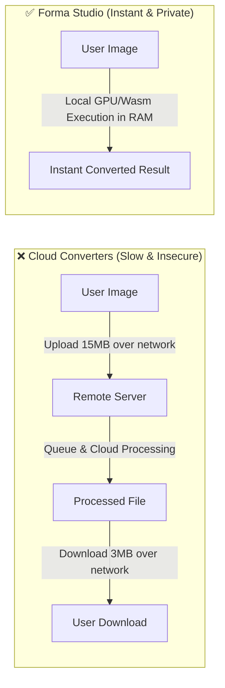

<div align="center">

# ⚡ FORMA IMAGE STUDIO
### *Next-Gen, 100% Private, Client-Side Browser Image Converter & Processing Suite*

[](https://vercel.com/new)
[](https://react.dev/)
[](https://www.typescriptlang.org/)
[](https://tailwindcss.com/)
[](#-privacy-first-architecture)
[](LICENSE)

<br />

**[🚀 Live Demo](https://forma-image.vercel.app/)** • **[✨ Features](#-core-features)** • **[📦 Formats](#-supported-formats-matrix)** • **[🛠️ Toolkit](#-dedicated-tool-suite)** • **[👨‍💻 Developer](#-developer--creator)**

<br />

```
  ┌─────────────────────────────────────────────────────────────────────────────┐
  │                                                                             │
  │   ███████╗ ██████╗ ██████╗ ███╗   ███╗ █████╗     ███████╗████████╗██╗   ██╗│
  │   ██╔════╝██╔═══██╗██╔══██╗████╗ ████║██╔══██╗    ██╔════╝╚══██╔══╝██║   ██║│
  │   █████╗  ██║   ██║██████╔╝██╔████╔██║███████║    ███████╗   ██║   ██║   ██║│
  │   ██╔══╝  ██║   ██║██╔══██╗██║╚██╔╝██║██╔══██║    ╚════██║   ██║   ██║   ██║│
  │   ██║     ╚██████╔╝██║  ██║██║ ╚═╝ ██║██║  ██║    ███████║   ██║   ╚██████╔╝│
  │   ╚═╝      ╚═════╝ ╚═╝  ╚═╝╚═╝     ╚═╝╚═╝  ╚═╝    ╚══════╝   ╚═╝    ╚═════╝ │
  │                                                                             │
  │     ⚡ 100% Private Client-Side Conversion • 🔒 Zero Cloud Uploads • 🚀 GPU     │
  └─────────────────────────────────────────────────────────────────────────────┘
```

</div>

---

## 🌟 Overview

**Forma** is an ultra-fast, modern image processing studio inspired by the minimal, high-contrast dark aesthetic of [Qraft](https://qraft-qr-generator.vercel.app/). 

Unlike traditional image converters that upload sensitive photos to remote cloud servers, **Forma processes every pixel directly inside the user's browser** using HTML5 Canvas 2D, WebAssembly, and native binary encoders. 

Your images never leave your computer or phone — guaranteeing **absolute privacy**, **zero network latency**, and **limitless batch conversions**.

---

## 🎨 Design Language & Aesthetic

Forma is built with a refined, tactile user interface:
- 🌌 **True OLED Pitch Black** (`#000000`) background for maximum battery efficiency and modern contrast.
- 🎴 **Tactile Elevated Surfaces** (`#0A0A0C` & `#111114`) with subtle `1px` high-tech borders.
- 🟢 **Electric Emerald Accents** (`#00E599` & `#05DF72`) with ambient radial backlighting.
- 🔤 **Typography**: Clean, geometric rendering powered by **Plus Jakarta Sans** and **JetBrains Mono**.
- 🌓 **Instant Theme Engine**: Smooth dark and light mode toggle with `localStorage` persistence.

---

## 🚀 Key Features

| Feature | Description |
| :--- | :--- |
| 🔒 **100% Client-Side Privacy** | Zero files uploaded to any server. Complete safety for private photos, documents, and medical scans. |
| ⚡ **Hardware Acceleration** | Uses client GPU & CPU multi-threading for instantaneous encoding and rendering. |
| 📦 **Batch Conversion & ZIP** | Upload dozens of files simultaneously; batch convert and download in a single streaming `.zip` package. |
| 📋 **Instant Clipboard Paste** | Simply hit <kbd>Ctrl</kbd> + <kbd>V</kbd> or <kbd>Cmd</kbd> + <kbd>V</kbd> anywhere on the page to immediately convert screenshots. |
| 📱 **Mobile-First Responsive** | Flawlessly optimized across 320px smartphones, iPad tablets, laptops, and 4K ultra-wide monitors. |
| 🧭 **Search & SEO Pathways** | Includes pre-routed landing pages for `/png-to-webp`, `/jpg-to-webp`, `/webp-to-jpg`, `/avif-converter`, and more. |

---

## 📊 Supported Formats Matrix

Forma houses custom binary encoders and codecs to support all standard web and high-performance image formats:

| Format | Extension | Processing Engine | Capabilities |
| :---: | :---: | :--- | :--- |
| **WebP** | `.webp` | Native Canvas 2D / libwebp | Lossless & lossy modern web compression |
| **PNG** | `.png` | Native Canvas 2D PNG Encoder | High-fidelity alpha channel transparency |
| **JPEG** | `.jpg`, `.jpeg` | Hardware JPEG Encoder | Adjustable quality matrix (1% to 100%) |
| **AVIF** | `.avif` | Next-gen AV1 Image Codec | Next-gen high compression ratio |
| **SVG** | `.svg` | Vector XML Data Envelope | Clean vector wrapping & raster conversions |
| **HEIC / HEIF** | `.heic`, `.heif` | WebAssembly `heic2any` Decoder | Native iPhone & Apple format decoding |
| **TIFF** | `.tiff`, `.tif` | Custom 24-bit TIFF 6.0 Binary Encoder | Uncompressed baseline photography archival |
| **BMP** | `.bmp` | Custom 24/32-bit Windows DIB Encoder | Raw uncompressed bitmap generation |
| **ICO** | `.ico` | Multi-Resolution Binary ICO Generator | 16x16, 32x32, 48x48, 64x64 multi-tier favicons |
| **GIF** | `.gif` | Canvas 2D Frame Exporter | Static raster GIF generation |

---

## 🧰 Dedicated Tool Suite

```
  ┌─────────────────┐   ┌─────────────────┐   ┌─────────────────┐
  │   🗜️ COMPRESS   │   │    📐 RESIZE    │   │    ✂️ CROP      │
  │  Reduce size by │   │ Custom pixels,  │   │ 1:1, 16:9, 4:3, │
  │    up to 90%    │   │ %, or presets   │   │  and Freeform   │
  └─────────────────┘   └─────────────────┘   └─────────────────┘
  ┌─────────────────┐   ┌─────────────────┐   ┌─────────────────┐
  │   🔄 ROTATE     │   │   🎛️ OPTIMIZE   │   │   🛡️ SCRUB EXIF │
  │ 90°, 180°, and  │   │ Exposure, tone, │   │ Strip GPS tags  │
  │  h/v flip mirror│   │ contrast & sat  │   │ & camera serials│
  └─────────────────┘   └─────────────────┘   └─────────────────┘
```

1. **Smart Image Compressor**
   - Interactive compression slider with real-time file size estimator and savings calculation (e.g., `2.8 MB → 640 KB (-78%)`).
2. **Dimension Resizer**
   - Aspect ratio lock, percentage scale, and instant social media presets (Instagram Square `1080×1080`, Story `1080×1920`, YouTube `1280×720`, Full HD `1920×1080`).
3. **Interactive Cropper**
   - Precise box drag handles, rule-of-thirds grid overlay, and fixed aspect ratio presets.
4. **Orientation & Flipper**
   - 90° CW/CCW rotations, 180° inversion, and horizontal / vertical mirror reflection.
5. **Color & Exposure Optimizer**
   - Fine-tune brightness, contrast, color saturation, and one-click grayscale or vintage sepia tones.
6. **EXIF & Privacy Scrubber**
   - Strips embedded GPS coordinates, camera serial numbers, device models, and capture timestamps before sharing online.

---

## ⚡ Performance: Forma vs Traditional Cloud Converters



| Metric | Traditional Cloud Converters | Forma Studio |
| :--- | :---: | :---: |
| **Privacy & Security** | ⚠️ Uploaded to remote servers | 🛡️ **100% In-Browser Local Memory** |
| **Network Latency** | ⏳ Upload + Download lag | ⚡ **Zero Network Lag (Instant)** |
| **File Size Limits** | ⛔ 5 MB – 10 MB limit (Paywall) | 🚀 **Virtually Unlimited** |
| **Subscription Required** | 💳 Paid tiers for bulk | 🆓 **100% Free Forever** |
| **Offline Support** | ❌ Fails without internet | ✅ **Runs completely offline** |

---

## 💻 Tech Stack

- **Framework**: [React 19](https://react.dev/) + [TypeScript](https://www.typescriptlang.org/)
- **Bundler & Dev Server**: [Vite 6](https://vitejs.dev/)
- **Styling**: [Tailwind CSS v4](https://tailwindcss.com/)
- **Icons**: [Lucide React](https://lucide.dev/)
- **Archiving**: [JSZip](https://stuk.github.io/jszip/)
- **HEIC Codec**: [heic2any](https://github.com/alexcorvi/heic2any)
- **Deployment**: [Vercel](https://vercel.com/) (Edge CDN with SPA routing)

---

## 🛠️ Local Development & Quick Start

### Prerequisites
- [Node.js](https://nodejs.org/) (version 18+ recommended)
- `npm` / `pnpm` / `yarn`

### 1. Clone & Install
```bash
git clone https://github.com/your-username/forma-image.git
cd forma-image
npm install
```

### 2. Start Development Server
```bash
npm run dev
```
Open [http://localhost:5173](http://localhost:5173) in your browser.

### 3. Windows 1-Click Launchers
If you are on Windows, simply double-click:
- `start.bat` — Installs dependencies and launches the dev server.
- `test-local.bat` — Interactive test suite (runs dev server, typecheck, or production build preview).

### 4. Build for Production
```bash
npm run build
```

---

## 🌐 Deploy to Vercel in 1 Minute

[](https://vercel.com/new)

1. Push this project to your GitHub repository.
2. Go to [vercel.com](https://vercel.com) and click **"Add New Project"**.
3. Import your GitHub repository.
4. Framework Preset will auto-detect as **Vite**.
5. Click **Deploy**.

> `vercel.json` is pre-configured with client-side SPA routing (`rewrites`) and security headers.

---

## 👨‍💻 Developer & Creator

Built with passion for high performance, clean UI design, and open privacy by **snuffdied**.

- 🌐 **Portfolio & Website**: [https://snuffdied.vercel.app/](https://snuffdied.vercel.app/)
- 💻 **Project**: [Forma Image Studio](https://forma-image.vercel.app/)

---

## 📄 License

This project is licensed under the **MIT License** — feel free to use, modify, and distribute it for personal and commercial projects.
